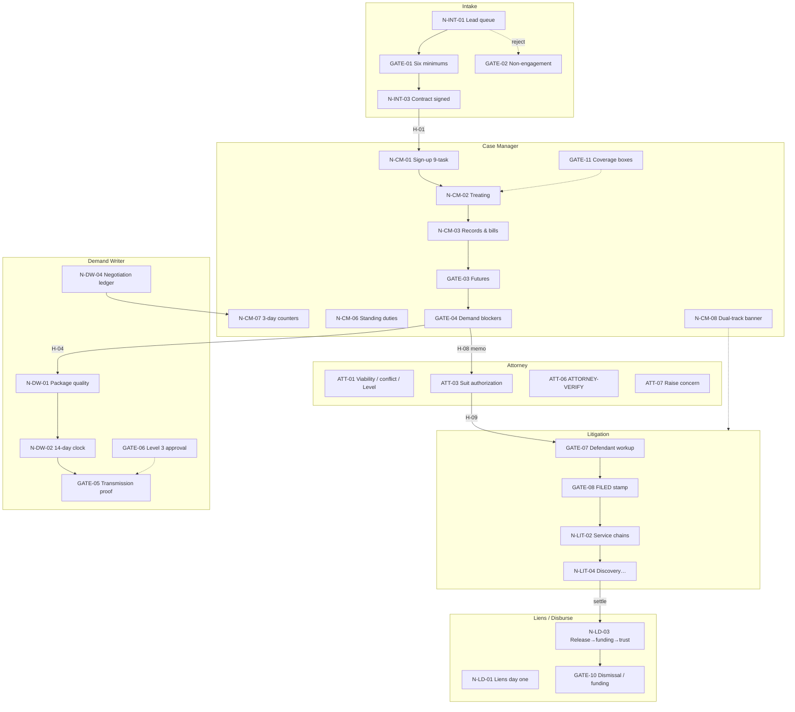

# Prompt for Claude — Visualize case lifecycle flowchart vs what we built

**How to use:** Paste this entire file into Claude. Optionally attach:
- `CASE_LIFECYCLE_AUDIT.md` (the assertion spec / companion to the PDF flowchart)
- `Tuttle-OS-Case-Lifecycle-Flowchart.pdf` (the visual, if available)
- `docs/FINDINGS_CHECKLIST.md`
- `docs/BUILD_PRIORITY_REVIEW_TODOS.md`

Ask Claude to **draw the case lifecycle as a flowchart colored by build status**, then list the biggest red/amber gaps.

---

## Your job (Claude)

Produce **one visual artifact** Michael or Brett can skim in under 5 minutes:

1. **A Mermaid flowchart** of the case lifecycle (lanes → nodes → gates → handoffs), with every node/edge labeled by status.
2. **A short legend** and **scoreboard** (counts).
3. **Top 10 gaps** in the **exact order** from `docs/LIFECYCLE_BUILD_PLAN.md` §9 (malpractice / money / wrong-entity). Do not re-rank.
4. Optional second diagram: **attorney decision points** (ATT-*) as a side lane.

**Do not** invent new status. Use only the scored table below.  
**Do not** treat DEFERRED as failure — gray them.  
**Do not** claim production/`main` — this is branch **`role-partition`** / preview.  
**Do not** re-rank the Top 10 gaps from the status tables. Copy the adopted plan order. Do not substitute INV-* or other invariants.

**Color / shape rules for Mermaid:**

| Status | Meaning | Mermaid style |
|---|---|---|
| `BUILT` | Implemented and enforced (gates = server/DB, not just UI) | Green fill (`fill:#d4edda,stroke:#28a745`) |
| `PARTIAL` | Present but incomplete or UI-only for a GATE | Amber fill (`fill:#fff3cd,stroke:#d39e00`) |
| `MISSING` | Not implemented | Red fill (`fill:#f8d7da,stroke:#dc3545`) |
| `DEFERRED` | Deliberately out of scope for now | Gray fill (`fill:#e9ecef,stroke:#6c757d`) |

Label nodes like: `GATE-01\nSix minimums\nPARTIAL`.  
Draw **handoffs as edges** with status on the edge label where scored (e.g. `H-01 PARTIAL`).  
Group subgraphs by lane: Intake · Case Manager · Demand Writer · Litigation · Liens · Attorney.

**Tone:** plain English under the diagram. No “we should refactor” — only what is / isn’t there.

**Branch / preview:** `role-partition` · https://tuttle-os-git-role-partition-tuttle-os.vercel.app  
**Scored:** 2026-08-09 against kit + FINDINGS_CHECKLIST / BUILD_PRIORITY  
**Rescore (2026-08-15, this ID only):** N-CM-08 MISSING→PARTIAL (CLIENT STILL TREATING banner on CM + Lit matter). H-12 gap narrowed to calendaring tie-breaker. Do not re-score other rows.  
**Rescore (2026-08-15, GATE-02 family only):** GATE-02 / N-INT-04 / H-02 PARTIAL→BUILT — server refuse on status-skip, convert-to-matter, and soft-delete until NEL is recorded. Reject + Record NEL buttons unchanged.  
**Rescore (2026-08-15, GATE-11 only):** louder coverage warning on CM matter + demand card. Status stays PARTIAL — does not refuse demand/stage.  
**Scoring rule:** UI-only enforcement of a GATE = `PARTIAL`, never `BUILT`.  
**Stage 3 lock (2026-08-15):** Mark Garza (1 CM) · stagger lit · preview only · preview + `cm.demo`. Do **not** claim production/`main`.

---

## Scoreboard (use these counts)

| Status | Count | % of 83 |
|---|---|---|
| BUILT | 11 | ~13% |
| PARTIAL | 46 | ~55% |
| MISSING | 17 | ~20% |
| DEFERRED | 9 | ~11% |
| **Total scored** | **83** | |

**Project read (one sentence for the diagram caption):**  
Stages 0–2 (roles, PD integrity, dashboards) are the green spine; GATE-02 (NEL) is server-enforced; most other GATEs remain PARTIAL or MISSING. Stage 3 CM beta is **in pilot** (Mark, preview, demo) with known amber/red gaps — dual-track **banner is live**, calendaring still open. This chart is lifecycle truth, not a merge-to-prod go/no-go.

---

## Suggested Mermaid skeleton (fill statuses from the tables)

Use this structure; replace labels with real IDs + status from the tables.

After drawing, apply `class` to every node from the status tables (`class G01 partial`, etc.).

---

## Scored inventory (source of truth — do not re-score)

### Lanes

| ID | Assertion | Status | What we have | Gap |
|---|---|---|---|---|
| LANE-01 | Six working roles + home routes | BUILT | Six homes + demo logins | admin unassigned; senior_paralegal † open |
| LANE-02 | CM + lit assigned-only lists | BUILT | staff_assignment scoping; Mark confirmed assigned-only on preview | — |
| LANE-03 | Attorney firm-wide | BUILT | Owner board | — |
| LANE-04 | One person, two roles | PARTIAL | staff_role_grant | Emily dual not prod-proven |
| LANE-05 | Lit → full CM; CM → lit milestone-only | PARTIAL | Switcher; CM sees milestones-only banner | Full lit tools still hidden from CM (by design for beta) |
| LANE-06 | Borrowed workspace audits real person | PARTIAL | staff_id on many writes | Preview actor edge cases |

### Blocking gates (highest value)

| ID | Gate | Status | What we have | Gap | Finding |
|---|---|---|---|---|---|
| GATE-01 | Six minimums block contract send | PARTIAL | Server gate; email waive + SOL preview | Full ES/WD/minor variant matrix | F-05 · F-06 |
| GATE-02 | Rejection incomplete until NEL sent | BUILT | NEL queue + record-sent + server refuse | — | — |
| GATE-03 | Futures before records clear | MISSING | — | No futures gate | F-25 |
| GATE-04 | Demand-ready while blockers open | PARTIAL | PD demand_blocker flag | No package-level refuse | F-33 cluster |
| GATE-05 | Demand sent needs channel proof | PARTIAL | Method/confirm fields | No artifact-required gate | F-34 |
| GATE-06 | Level 3 needs attorney approval | PARTIAL | Attention notice | Send not server-blocked | ATT-02 |
| GATE-07 | Defendant workup before filing prep | MISSING | — | No workup gate | F-45 |
| GATE-08 | FILED only on file-stamped copy | MISSING | Lit MVP / docs | No stamp completion gate | F-44 |
| GATE-09 | Plaintiff depo READY = prep+session | DEFERRED | Designed | P2 | F-49 |
| GATE-10 | Dismissal blocked until funding confirmed | DEFERRED | — | Stage 4 | F-54 |
| GATE-11 | Coverage = provider or No treatment | PARTIAL | Coverage UI + louder warning | Does not refuse demand/stage | F-24 adj. |

### Nodes — Intake

| ID | Node | Status | What we have | Gap |
|---|---|---|---|---|
| N-INT-01 | Lead call / queue | BUILT | /intake queue + detail | — |
| N-INT-02 | Six minimums | PARTIAL | = GATE-01 | Variant depth |
| N-INT-03 | contract_signed event | PARTIAL | Matter + signed date | No auto fires (welcome/rotation/packet) |
| N-INT-04 | Rejected → NEL | BUILT | = GATE-02 | — |

### Nodes — Case Manager

| ID | Node | Status | What we have | Gap | Finding |
|---|---|---|---|---|---|
| N-CM-01 | 9-task sign-up · 7-day · LOR sent≠generated | PARTIAL | Checklist / LOR hooks | Full 9 + sent discipline | F-19 |
| N-CM-02 | Treating cadence + escalate | PARTIAL | Episodes + call log | +14 / 2-day engine | F-24 |
| N-CM-03 | Records & bills · packet · 7d respawn | PARTIAL | Docs + gallery | One-click packet + respawn | F-27–29 |
| N-CM-04 | Futures | MISSING | — | GATE-03 | F-25 |
| N-CM-05 | Package to Kate | PARTIAL | Blocker flags; /demands skeleton | GATE-04 + clock | — |
| N-CM-06 | Standing: PD · PIP · CMS · ≤30d | PARTIAL | PD strong (queue matches file; near-miss duplicate block; photo↔vehicle); contact attention; liens list | Day-one CMS; PIP thin | F-21 |
| N-CM-07 | 3-day counters CM+Kate | MISSING | — | No dual task | F-36 |
| N-CM-08 | CLIENT STILL TREATING banner | PARTIAL | Banner on CM + Lit matter | Calendaring / tie-breaker open | F-43 |

### Nodes — Demand Writer

| ID | Node | Status | What we have | Gap | Finding |
|---|---|---|---|---|---|
| N-DW-01 | Package quality gate | DEFERRED | /demands skeleton | Kate screens | §8 |
| N-DW-02 | 14-day clock | MISSING | Intent only | No clock UI | — |
| N-DW-03 | Send + proof | PARTIAL | Send fields | GATE-05 | F-34 |
| N-DW-04 | Negotiation ledger + direction | BUILT | Ledger + server directionality | time_request type | F-37 |

### Nodes — Litigation

| ID | Node | Status | What we have | Gap | Finding |
|---|---|---|---|---|---|
| N-LIT-01 | File suit / workup / FILED | MISSING | Lit MVP | GATE-07/08 | F-44–45 |
| N-LIT-02 | Per-defendant service · 5d respawn | PARTIAL | Chain design (documented) | Confirm all defendants + orphan board | — |
| N-LIT-03 | Answer → clocks | PARTIAL | Answer/disclosure handoff design | Full clock set | — |
| N-LIT-04 | Discovery · 18.001 · depos · med · trial | PARTIAL | Some clocks/tables | Mostly DESIGNED/thin | F-46–52 |
| N-LIT-05 | N defendants → N chains | PARTIAL | Per-defendant model | Orphan detect UI | — |
| N-LIT-06 | SOL watchlist until last served | PARTIAL | SOL / JX attention | Last-served exit rule | — |

### Nodes — Liens

| ID | Node | Status | What we have | Gap | Finding |
|---|---|---|---|---|---|
| N-LD-01 | Liens day one via CMS | PARTIAL | /liens worklist | No CMS inquiry workflow | F-21 |
| N-LD-02 | Medicare conditional-payment clock | MISSING | — | Not tracked | — |
| N-LD-03 | Release → funding → trust | DEFERRED | Finance banner | Stage 4 | §8 |
| N-LD-04 | Disburse REMIT · close · analytics | DEFERRED | — | Stage 4 | §8 |

### Attorney decisions

| ID | Decision | Status | What we have | Gap |
|---|---|---|---|---|
| ATT-01 | Viability · conflict · Level | PARTIAL | can_clear_conflicts; Level notice; SOL verify UI | 7-day viability + Level red everywhere |
| ATT-02 | Level 3 demand approval | PARTIAL | Notice | GATE-06 |
| ATT-03 | File-suit auth → 4 atomic effects | MISSING | — | F-40 |
| ATT-04 | Petition sig · default · experts queue | MISSING | — | Thin attorney queue |
| ATT-05 | Settlement advice vs client decision | MISSING | — | Friendly-suit owner open |
| ATT-06 | ATTORNEY-VERIFY on computed deadlines | PARTIAL | Badge on matter | Not every branch |
| ATT-07 | Raise concern → Michael; no pause | MISSING | — | F-42 |

### Handoffs (edges)

| ID | From → To | Status | What we have | Gap | Finding |
|---|---|---|---|---|---|
| H-01 | Intake → CM on contract_signed | PARTIAL | Matter created; assignable | Welcome · packet · rotation · 9-task auto | F-14–18 |
| H-02 | Intake → closed (reject + NEL) | BUILT | Reject + NEL + server refuse | — | — |
| H-03 | WD/minor/L3/conflict → Attorney | PARTIAL | Badges / chips | No disposition queue | F-08 · F-04 |
| H-04 | CM → Demand Writer demand-ready | PARTIAL | Skeleton /demands | GATE-04 + 14-day | — |
| H-05 | Demand → Attorney Level 3 | PARTIAL | Attention notice | GATE-06 hold send | — |
| H-06 | Demand → carrier | PARTIAL | Deadline field; receipt flag | Dual calendar + GATE-05 | F-33–35 |
| H-07 | Carrier response → 3-day CM+Kate | MISSING | Negotiation log | F-36 | F-36 |
| H-08 | File-suit memo → Attorney | DEFERRED | — | F-39 | F-39 |
| H-09 | suit_authorized → four effects | DEFERRED | — | ATT-03 / F-40 | F-40 |
| H-10 | Paralegal concern → Attorney | MISSING | — | ATT-07 | F-42 |
| H-11 | Petition filed → service chains arm | PARTIAL | Service chain design | GATE-07/08 | — |
| H-12 | CM ↔ Lit dual-track | PARTIAL | Switcher + banner | Tie-breaker open | F-43 |
| H-13 | Settle → Liens | DEFERRED | Liens banner | Stage 4 · GATE-10 | — |
| H-14 | Liens → closed | DEFERRED | — | UM/UIM owner open | — |

### Cross-cutting invariants

| ID | Invariant | Status | What we have | Gap |
|---|---|---|---|---|
| INV-01 | Every write has actor | PARTIAL | created_by / staff_id many paths | Not universal |
| INV-02 | Soft delete only; additive schema | BUILT | deleted_at pattern | Keep enforcing |
| INV-03 | Deadline precedence resolver | MISSING | Deadline rows | No shared resolver |
| INV-04 | §18.001 earlier-of | PARTIAL | Clocks/tables | Auto min() unclear |
| INV-05 | Negotiation directionality server-side | BUILT | UI + action validation; SQL CHECK ready | Apply SQL on Supabase |
| INV-06 | No auto-docket from unverified rules | PARTIAL | ATTORNEY-VERIFY culture | Local-rule warn path thin |
| INV-07 | Respawn ends on data event | PARTIAL | Service chain pattern | Not universal |
| INV-08 | Overdue pins red; never ages off | PARTIAL | Attention boards | Universal pin unproven |
| INV-09 | MOTION PENDING non-ageing | MISSING | motion table | No flag/UI |
| INV-10 | Expense prompts at event | MISSING | case_expense schema | No prompts |
| INV-11 | Dates show day·month·year | PARTIAL | MM/DD/YYYY convention | Spot-check remaining |
| INV-12 | Document land completes task | PARTIAL | Some chain auto-completes | Not general |
| INV-13 | Backward deadline rolls → VERIFY | PARTIAL | Verify badge | Silent adjust guard |
| INV-14 | Multi-plaintiff companion rules | PARTIAL | incident_group | Per-plaintiff settlement depth |

### Data model

| ID | Assertion | Status | What we have | Gap |
|---|---|---|---|---|
| DM-01 | Task chain fields | PARTIAL | Lit chain design | Not universal |
| DM-02 | Deadline rank / supersede / verify / JX | PARTIAL | Some columns | Full model incomplete |
| DM-03 | Per-defendant chains first-class | PARTIAL | Design | Case-level “in service” |
| DM-04 | Document gates store completing doc ID | PARTIAL | Docs linked | Provable IDs uneven |
| DM-05 | incident_group | BUILT | Companions + lead link | Conflict-waiver thin |

---

## Open questions (do not invent answers — list as OPEN on the chart)

Stage 3 shape is **locked** (not OPEN): Mark Garza, stagger lit, preview only, preview+demo.

Still OPEN:

1. Daniel’s authority — which ATT-* he may issue alone  
2. Administrator role holder  
3. UM/UIM sequencing owner (H-14)  
4. Friendly-suit logistics owner (ATT-05)  
5. Photo-reminder stop condition (INV-07)  
6. Dual-track tie-breaker (H-12) — banner exists; calendaring rule does not  
7. Unassigned media pen default owner  

---

## Known deferred (gray, not red)

- Automatic CM rotation + Spanish routing (F-14)  
- Kate’s full demand screens (`/demands` skeleton)  
- Liens finance / disbursement UI (blocks N-LD-03/04)  
- File-suit memo + suit authorization UI (F-39 / F-40)  
- One-click records + billing + §18.001 packet (F-27–29)  
- Full task/respawn engine breadth  
- Anything requiring production merge to `main`

---

## After the diagram — also output

### A. Caption (2–3 sentences)
Where the firm is on the lifecycle machine vs the PDF/flowchart intent.

### B. Top 10 gaps (ranked)

**Use this exact order.** Canonical source: `docs/LIFECYCLE_BUILD_PLAN.md` §9. Do **not** re-rank from MISSING vs PARTIAL, do **not** swap in INV-03 or other invariants, do **not** justify a different order.

1. GATE-03 — Futures  
2. GATE-04 — Demand-ready blockers  
3. GATE-07 — Defendant workup  
4. GATE-08 — FILED stamp  
5. H-01 — Intake → CM automation  
6. H-07 — 3-day counters  
7. N-CM-08 — Dual-track calendaring / tie-breaker (banner is already live)  
8. ATT-03 — Suit authorization  
9. GATE-05 / GATE-06 — Proof and Level 3 hold  
10. Stage 4 — H-13 / H-14 / GATE-10  

Under each rank, one sentence from the plan’s “Why it ranks here.” N-CM-08: banner is live; the remaining gap is auto-calendaring of §18.001 / discovery / plaintiff depo.

### C. What Stage 3 CM beta can ignore
List DEFERRED + lit/suit/settlement reds that are OK to ship past for CM pilot (point to BUILD_PRIORITY Stage 3 / `docs/CM_BETA_RUNBOOK.md`).  
**Do not** list the dual-track banner as missing — it is live on preview (N-CM-08 PARTIAL). Still ignore auto-calendaring of 18.001 / discovery / plaintiff depo (tie-breaker OPEN).

### D. Optional ASCII one-pager
If Mermaid won’t render in the chat UI, also give a compact ASCII swimlane with `[G]` green / `[A]` amber / `[R]` red / `[D]` gray abbreviations.

---

## Build-stage context (for caption only)

| Stage | Status | Maps roughly to |
|---|---|---|
| 0 Foundation | Done on preview | Lanes, demo logins, P1 consolidation (0 P1 DONE) |
| 1 Data integrity | Done on preview | PD (incl. near-miss duplicate + queue vs file), INV-05, coverage labels |
| 2 Role dashboards | Done on preview | Needs attention / queues — Mark morning list passed 2026-08-15 |
| 3 CM beta | **Locked / in pilot** — Mark (1 CM), stagger, preview+demo | Known gaps sent; do **not** merge to main |
| 4 Settlements / disburse | Not started | N-LD-03/04 · H-13/14 · GATE-10 |
| 5 Lit rollout | Stagger after CM (**locked**) | GATE-07/08 · N-LIT-* · ATT-03 |
| 6 Migration | Last | — |

---

**End of prompt.** Claude: draw the colored flowchart first, then A–D.
