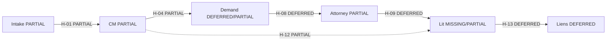

# Prompt for Claude — Build a PDF: Lifecycle build plan vs current kit

> **Canonical plan in the kit:** `docs/LIFECYCLE_BUILD_PLAN.md`  
> Prefer attaching that file and saying “export this to PDF.” This prompt is the longer brief that produced it; keep both in sync if you revise either.

**How to use:** Paste this entire file into Claude. Then say:

> Produce the PDF-ready document described below. Export or download as PDF when done (or give me clean markdown I can Print → Save as PDF).

Optional attachments (if available in the chat):
- `docs/LIFECYCLE_BUILD_PLAN.md` (**preferred** — already the adopted plan)
- `docs/CLAUDE_PROMPT_LIFECYCLE_FLOW_VS_BUILD.md` (scored inventory)
- `CASE_LIFECYCLE_AUDIT.md`
- `docs/CM_BETA_RUNBOOK.md`
- `docs/BUILD_PRIORITY_REVIEW_TODOS.md`

If those are not attached, **use only the content in this file** — do not invent new statuses or stages.

---

## Your job (Claude)

Create a **short, print-ready planning PDF** (target **6–10 pages**) that Brett/Michael can read offline.

**Title:** Tuttle OS — Case Lifecycle Build Plan  
**Subtitle:** How we close the flowchart gaps without breaking Stage 3  
**Audience:** Michael (owner) · Brett (ops) · builders (Cursor / Claude)  
**Date line:** August 2026 · Branch `role-partition` (preview) · Not production/`main` until sign-off  

### Required sections (in order)

1. **Cover / one-page summary** — what this plan is, what it is not, and the one-sentence project read  
2. **Non-negotiable rules** — protect the project; no overwrite without consult  
3. **Where we are** — scoreboard table + Stage 0–6 status  
4. **Colored lifecycle snapshot** — Mermaid flowchart (BUILT / PARTIAL / MISSING / DEFERRED) *or* a simple swimlane table if Mermaid won’t render in PDF  
5. **Phased plan** — Phase 0 → 2, then Tracks A–F with ordered work items  
6. **Anti-break checklist** — how each ticket is run; stop-and-ask triggers  
7. **Top 10 gaps** — malpractice / money / wrong-entity first  
8. **What Stage 3 can ignore** — deferred / lit / settlement reds OK to ship past for CM pilot  
9. **Open questions for Michael** — audit §9 + F-01/F-04/F-05/F-14  
10. **Next decision** — A / B / C choices (finish Stage 3 vs parallel harden vs docs-only)

### Format rules for PDF

- Clean headings, short paragraphs, tables over prose  
- Page-friendly: avoid giant code dumps; one Mermaid diagram max  
- Use this legend everywhere:

| Status | Meaning | PDF color cue |
|---|---|---|
| BUILT | Enforced in code/DB (gates = server, not UI-only) | Green |
| PARTIAL | Present but incomplete or UI-only for a GATE | Amber |
| MISSING | Not implemented | Red |
| DEFERRED | Deliberately out of scope for now | Gray |

- Tone: plain English, decision-oriented. No jargon unless you define it once.  
- **Do not** re-score the inventory. Copy statuses from § Source data below.  
- **Do not** turn this into a full 83-row dump in the PDF body — put a **one-page scoreboard**, then **gates + handoffs** tables only; say the full inventory lives in the companion prompt/scoreboard.  
- Footer on each logical section: `role-partition · not main · consult before overwrite`

### Deliverable shape

Prefer, in order:

1. **Native PDF export** from Claude if available, **or**  
2. **Print-ready markdown** with a note: “File → Print → Save as PDF” / “Export to PDF”, **or**  
3. **HTML** suitable for browser print to PDF  

Also give a **1-paragraph blurb** Brett can paste into email when attaching the PDF.

---

## Source data (authoritative — do not change)

### One-sentence project read

Stages 0–2 (roles, PD integrity, dashboards) are the green spine; GATE-02 (NEL) is server-enforced; most other GATEs remain PARTIAL or MISSING. Stage 3 CM beta ships with known amber/red gaps. This plan is lifecycle truth and sequencing — **not** a reason to delay CM beta or rewrite working screens.

### Scoreboard (83 assertions)

| Status | Count | ~% |
|---|---|---|
| BUILT | 11 | 13% |
| PARTIAL | 46 | 55% |
| MISSING | 17 | 20% |
| DEFERRED | 9 | 11% |

**Rescore (2026-08-15, GATE-02 family only):** GATE-02 / N-INT-04 / H-02 PARTIAL→BUILT — server refuse until NEL is recorded. Reject + Record NEL buttons unchanged.

### Build stages

| Stage | Status | Maps to |
|---|---|---|
| 0 Foundation | Done on preview | Lanes, demo logins, P1 consolidation (0 Jul-19 P1 fully DONE) |
| 1 Data integrity | Done on preview | PD edit/remove/photos, negotiation directionality, coverage “No treatment” |
| 2 Role dashboards | Done on preview | Needs attention / CM & lit queues |
| 3 CM beta | In progress — Michael sign-off | Ship with known gaps; PR `role-partition` → `main` gated |
| 4 Settlements / disburse | Not started | Liens finance sequence, GATE-10 |
| 5 Lit rollout | Stagger after CM (proposed) | Workup, FILED stamp, suit auth |
| 6 Migration | Last | After schema settles |

Preview: https://tuttle-os-git-role-partition-tuttle-os.vercel.app  
PR: https://github.com/TuttleOS/TuttleOS/pull/1  

---

## Non-negotiable rules (print verbatim)

1. **Stage 3 first** — CM beta / Michael sign-off / merge gate is the near-term track. Lifecycle work does not rip up preview.  
2. **Additive only** — soft delete, new columns/migrations, new actions. No rewrite of working PD, negotiation, or role partition.  
3. **Consult before overwrite** — if a change alters behavior Michael already accepted, contract/reject/NEL paths, RLS, or active demo fixtures → **stop and ask**.  
4. **Branch discipline** — work on `role-partition` or short-lived branches off it. No lifecycle drive onto `main` before Stage 3 sign-off.  
5. **Score before build** — confirm audit ID → 5-line touch list → approve → implement → preview smoke → update scoreboard/findings for that ID only. No drive-by refactors.

### Hard stop-and-ask triggers

- Deleting or renaming routes, role codes, or demo accounts  
- Changing contract send / reject / non-engagement letter behavior  
- Changing RLS or `staff_role_grant` semantics  
- Replacing Demand or Liens skeletons with a new information architecture  
- Hard delete, data backfill, or migrations that rewrite existing rows  
- “While I’m here” refactors outside the ticket  

---

## Phased plan (print as the spine of the PDF)

### Phase 0 — Freeze & protect (before new features)

| Step | Action |
|---|---|
| 0.1 | Treat `role-partition` + PR #1 as protected baseline |
| 0.2 | Do not reopen Stage 0–2 done items unless a real bug is reported |
| 0.3 | Keep flowchart/scoreboard docs as planning maps — not a rebuild brief |
| 0.4 | Michael confirms Stage 3 (pilot size, lit stagger, known-gaps sheet) |

**Exit:** Stage 3 decision recorded.

### Phase 1 — Decision gate (Michael) before high-risk build

Do not invent policy in code for:

- F-01 / F-04 / F-05 — minor/parent, conflict waiver, contract variant matrix (GATE-01 depth)  
- F-14 — CM rotation / Spanish routing  
- Audit open questions — Daniel’s † authority, admin holder, UM/UIM owner, friendly-suit owner, dual-track tie-breaker, photo-reminder stop, unassigned media owner  

### Phase 2 — Safe slices (after Stage 3 path is clear)

Order: **low overwrite risk → high**; **CM-adjacent before lit/settlement**.

#### Track A — Harden what exists (lowest risk)

1. GATE-02 — **Done 2026-08-15** — NEL hard-blocks close (server refuse on status-skip / convert / delete)  
2. GATE-11 — louder warn OK; **consult** before blocking stage advance  
3. N-CM-08 — additive “CLIENT STILL TREATING” banner  
4. Apply SQL `21_upgrade_v2.20_negotiation_directionality.sql` on Supabase when ready (additive CHECK; app already validates)  

#### Track B — CM package spine

5. GATE-04 — demand-ready package refuse from existing blockers (don’t rebuild Demand UI)  
6. GATE-03 / F-25 — futures amount+procedure or documented “no futures” (**consult schema**)  
7. N-CM-03 / F-27–29 — one-click packet + 7-day respawn (**consult** — large surface; may stay deferred until after CM beta)  

#### Track C — Intake handoff (needs Phase 1 decisions)

8. GATE-01 depth — variants EN/ES / WD / minor  
9. H-01 fires — welcome / assignment / checklist spawn (**consult** vs manual CM assign)  

#### Track D — Demand / Kate (walkthrough-gated)

10. GATE-05 / GATE-06 — transmission proof + Level 3 hold send  
11. H-07 / F-36 — 3-day counter on CM + Kate  
**Rule:** Do not build Kate’s full screens until her walkthrough; keep skeleton.  

#### Track E — Lit / suit (Stage 5)

12. ATT-03 / H-08–H-09 · GATE-07 · GATE-08 — only after CM beta stable  

#### Track F — Liens / settlement (Stage 4)

13. H-13 / H-14 · GATE-10 · N-LD-03/04 — last product track before migration  

---

## Gates & handoffs (include these two tables in the PDF)

### Blocking gates

| ID | Gate | Status | Gap |
|---|---|---|---|
| GATE-01 | Six minimums block contract send | PARTIAL | Full ES/WD/minor variant matrix |
| GATE-02 | Rejection incomplete until NEL sent | BUILT | Server refuse until NEL recorded |
| GATE-03 | Futures before records clear | MISSING | No futures gate |
| GATE-04 | Demand-ready while blockers open | PARTIAL | No package-level refuse |
| GATE-05 | Demand sent needs channel proof | PARTIAL | No artifact-required gate |
| GATE-06 | Level 3 needs attorney approval | PARTIAL | Send not server-blocked |
| GATE-07 | Defendant workup before filing prep | MISSING | No workup gate |
| GATE-08 | FILED only on file-stamped copy | MISSING | No stamp completion gate |
| GATE-09 | Plaintiff depo READY | DEFERRED | P2 |
| GATE-10 | Dismissal until funding confirmed | DEFERRED | Stage 4 |
| GATE-11 | Coverage = provider or No treatment | PARTIAL | Does not refuse advance |

### Handoffs

| ID | Transition | Status | Gap |
|---|---|---|---|
| H-01 | Intake → CM on contract_signed | PARTIAL | Welcome · packet · rotation · 9-task auto |
| H-02 | Intake → closed (reject + NEL) | BUILT | GATE-02 server refuse |
| H-03 | WD/minor/L3/conflict → Attorney | PARTIAL | No disposition queue |
| H-04 | CM → Demand Writer | PARTIAL | GATE-04 + 14-day clock |
| H-05 | Demand → Attorney Level 3 | PARTIAL | GATE-06 hold send |
| H-06 | Demand → carrier | PARTIAL | Dual calendar + proof |
| H-07 | Carrier response → 3-day CM+Kate | MISSING | No dual task |
| H-08 | File-suit memo → Attorney | DEFERRED | F-39 |
| H-09 | suit_authorized → four effects | DEFERRED | F-40 |
| H-10 | Paralegal concern → Attorney | MISSING | No concern queue |
| H-11 | Petition filed → service chains | PARTIAL | GATE-07/08 |
| H-12 | CM ↔ Lit dual-track | PARTIAL | Banner + tie-breaker |
| H-13 | Settle → Liens | DEFERRED | Stage 4 |
| H-14 | Liens → closed | DEFERRED | UM/UIM owner open |

---

## Top 10 gaps (rank these in the PDF; keep this order unless you briefly justify a swap)

1. GATE-03 — Futures  
2. GATE-04 — Demand-ready blockers  
3. GATE-07 — Defendant workup  
4. GATE-08 — FILED stamp  
5. H-01 — Intake → CM automation  
6. H-07 — 3-day counters  
7. N-CM-08 — Dual-track banner  
8. ATT-03 — Suit authorization atomic effects  
9. GATE-05 / GATE-06 — Proof + Level 3 hold  
10. Stage 4 — H-13 / H-14 / GATE-10 settlement → disburse  

---

## What Stage 3 CM beta can ignore (print as a calm callout)

OK to ship past for CM pilot (document as known gaps, not failed checks):

- Full Kate demand screens (DEFERRED)  
- Liens finance / disbursement UI (Stage 4)  
- File-suit memo + suit authorization (Stage 5)  
- GATE-07 / GATE-08 / most N-LIT depth  
- One-click records packet + full respawn engine (consult before building; may wait)  
- Clearing all 83 audit rows  

CM pilot still needs honesty about: incomplete GATE-01 variants, no futures gate, package refuse incomplete, no dual-track banner yet.

---

## Open questions for Michael (checklist in PDF)

- [ ] Stage 3: pilot size (recommend 1–2 CMs) + lit stagger yes/no  
- [ ] F-01 minor/parent matter structure  
- [ ] F-04 conflict waiver workflow  
- [ ] F-05 contract variant matrix (EN/ES × standard/minor/WD)  
- [ ] F-14 CM rotation / Spanish routing  
- [ ] Daniel’s † authority (which ATT-* alone)  
- [ ] Administrator role holder  
- [ ] UM/UIM sequencing owner  
- [ ] Friendly-suit logistics owner  
- [ ] Dual-track tie-breaker  
- [ ] Photo-reminder stop condition  
- [ ] Unassigned media pen default owner  

---

## Next decision (end the PDF here)

| Option | Meaning |
|---|---|
| **A** | Finish Stage 3 (sign-off → Auth → merge); park lifecycle map | **Default** |
| **B** | Start Track A (safe harden) on `role-partition` while waiting on Michael |
| **C** | Docs-only — keep this PDF + scoreboard; no feature code until A is chosen |

Recommended default: **A**, with **B** only if Stage 3 waits on Michael for several days.

---

## Mermaid for §4 (optional; color nodes by status)

Expand into lane subgraphs if space allows; keep under one page.

---

## Anti-break checklist (one box per ticket — include in PDF)

For every build ticket:

1. Name audit IDs (e.g. GATE-04)  
2. List files/tables that will change — if many hot paths or any RLS/migration → pause for approval  
3. State additive plan; call out any behavior change to existing buttons  
4. Human approves touch list  
5. Build on branch → preview smoke → update that ID only in scoreboard/findings  
6. Commit/push only when asked  

---

**End of prompt.** Claude: build the PDF (or print-ready export) now. Do not start implementing product code.
