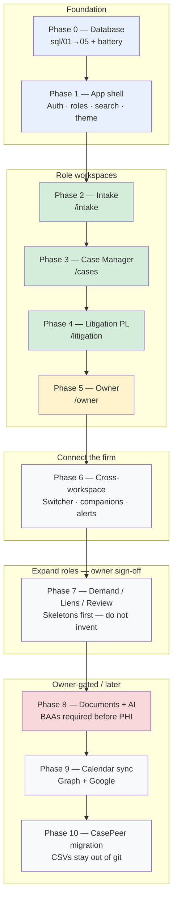
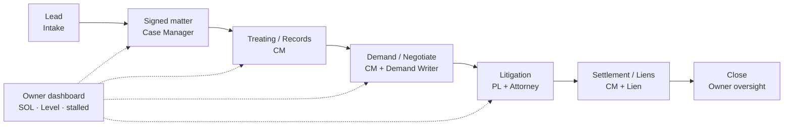
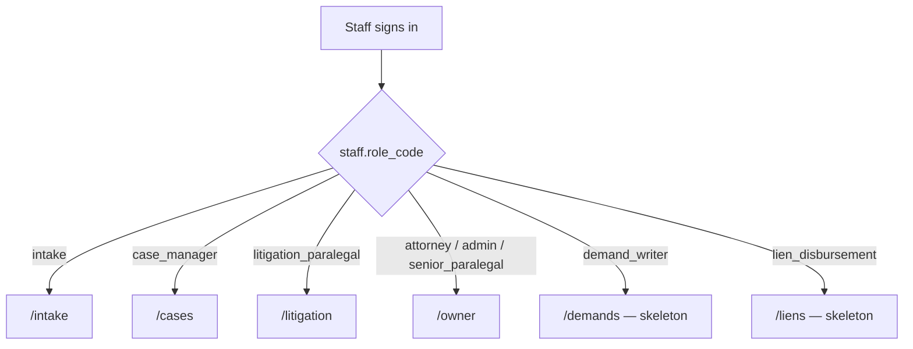

# Tuttle OS — Project Phase Flow (CTO view)

**Purpose:** Confirm we are building the *right* product, in the *right* order.  
**Sources of truth:** `MASTER_PROMPT.md`, `docs/ui-design-decisions.md`, `docs/COMPLIANCE_GATES.md`, `mockups/*.html`.  
**Stack:** Next.js (App Router) + Tailwind + Supabase (Auth + Postgres + RLS). Schema lives in `sql/01`→`05`; do **not** invent workflow the DB does not support.  
**Schema diagrams:** [`docs/SCHEMA_FLOW.md`](SCHEMA_FLOW.md) (spine, stages, engines, RLS).

---

## What we are building

**Tuttle OS** is the firm’s practice OS for Crash Guy Injury Attorneys / Tuttle Law Firm — one app, **role-based workspaces**, after login:

| Role | Home workspace | Route prefix |
|---|---|---|
| Intake | Lead queue | `/intake` |
| Case Manager | Caseload | `/cases` |
| Litigation Paralegal | Lit caseload | `/litigation` |
| Attorney / Admin / Senior PL | Owner dashboard | `/owner` |
| Demand Writer | Skeleton only (Phase 7) | `/demands` |
| Lien / Disbursement | Skeleton only (Phase 7) | `/liens` |
| Senior Reviewer | Skeleton only (Phase 7) | `/review` |

**Non‑negotiables (every phase):** soft delete · actor on every write · dates `MMM d, yyyy` · **ATTORNEY-VERIFY** on rule-computed legal dates · RLS is the real gate (UI lock is secondary) · no client-side “authoritative” deadline math.

---

## Phase flow (do in order)

Each numbered phase in `MASTER_PROMPT.md` §7 ends with **Playwright** covering mockup behavior. Security exit criteria are in `docs/COMPLIANCE_GATES.md`.

### Build spine

**Legend:** green = MVP shipped · yellow = finishing · red = blocked on owner/BAA · gray = not started

### How a matter moves through the firm (product flow)

### Who lands where after login

---

## Status snapshot (as of Phase 5 MVP)

| Phase | Intent | Status | Notes |
|---:|---|---|---|
| **0** | Schema on Supabase; battery green | **Done (eng)** | Owner still owns BAA before real PHI |
| **1** | Auth, shell, role routing, search, theme | **Done (MVP)** | MFA enforcement / firm password manager = owner ops |
| **2** | Intake workspace | **Done (MVP)** | Mockup: `intake-workspace-mockup.html` |
| **3** | Case Manager workspace | **Done (MVP)** | Caseload, matter Focus, My Tasks — not every §6 card |
| **4** | Litigation Paralegal workspace | **Done (MVP)** | Caseload, Deadline Horizon, tasks, matter Focus — **deferred:** pizza tracker, full discovery/mediation, RingCentral |
| **5** | Owner dashboard | **In progress (MVP)** | Stalled + Approvals + SOL + override strip — **deferred:** Conflicts / 7‑Day Reviews / full audit stream as own routes |
| **6** | Cross-workspace switcher + companions + notifications | **Next after 5 locked** | |
| **7** | Demand / Liens / Review | **Later** | Skeletons only until Michael signs screens |
| **8** | Documents + AI | **Blocked until owner** | Optional SQL; BAAs required before PHI OCR/AI |
| **9** | Calendar ↔ deadlines | **Later** | |
| **10** | CasePeer CSV load | **Owner-run** | CSVs stay out of git |

“MVP” here means **schema-backed vertical slices** that match AppShell nav and mockup *jobs*, not pixel-perfect full mockups.

---

## Phase-by-phase detail

### Phase 0 — Database foundation
- Apply `sql/01_schema_v2.0.sql` → `05_upgrade_v2.5_naming.sql`.
- Run `sql/tests/test_v2.5_battery.sql` (must PASS).
- Expose schemas + `GRANT app_staff TO authenticated`.
- **Stop:** no production PHI until Supabase BAA signed.

### Phase 1 — Foundation (app)
- Supabase Auth; link `core.staff.auth_user_id`.
- AppShell, parchment/midnight tokens, role home routes, global search.
- Security headers; secrets only in `.env.local` / host secrets (never git).

### Phase 2 — Intake
- Mockup: `mockups/intake-workspace-mockup.html`.
- Lead queue, new lead, activity, lead detail; phone US/MX; SOL display + ATTORNEY-VERIFY.
- Rejection incomplete until non-engagement path (gate W.8).

### Phase 3 — Case Manager
- Mockup: `mockups/case-manager-workspace-mockup.html`.
- `/cases`, `/cases/[id]`, `/cases/tasks`; stalled flags via `workflow.v_stalled_cases`.
- Full mockup has many cards (treatment, PD, demands, financials) — ship incrementally; **do not invent** finance workflows behind RLS.

### Phase 4 — Litigation Paralegal
- Mockup: `mockups/litigation-paralegal-workspace-mockup.html`.
- **Shipped MVP:** `/litigation`, `/litigation/deadlines`, `/litigation/tasks`, `/litigation/[id]`.
- **Still in full mockup / later:** 17-node pizza tracker, service chains, DCO forms, discovery deficiency pipeline, calendar sync (Phase 9), task-chain migration rehearsal (gate 4.a).

### Phase 5 — Owner dashboard
- Mockup: `mockups/owner-dashboard-mockup.html`.
- **Shipped / finishing MVP:** `/owner` (stalled + filters + override patterns), `/owner/approvals` (Level + L3 demand when present), `/owner/sol` (`core.v_sol_reconciliation`).
- **Deferred to follow-on:** dedicated Conflicts, 7-Day Reviews, Overrides & Audit, My Activity tabs (can stay panels or new routes later).
- Capability gates: `can_approve_level` / `can_clear_conflicts` / `is_attorney` (DB + UI).

### Phase 6 — Cross-workspace
- CM ↔ Litigation switcher; audits as **acting user**; companion / conflict-waiver rules stay DB-enforced.
- Notifications without unnecessary PHI in subjects.

### Phase 7 — Remaining workspaces
- Schema exists (`resolution.*`, `liens.*`, viability).
- **Build skeletons → STOP → Michael reviews screen proposals.** Do not invent Kate/Emily/Daniel workflows.

### Phase 8 — Documents + AI (owner-gated)
- Apply `sql/optional/06` then `07` only after owner approval.
- Private Storage bucket; AI feature flag **off** by default.
- **Hard stop:** OCR + Claude BAAs before real medical records.

### Phase 9 — Calendar sync
- Microsoft Graph **and** Google adapters; every `workflow.deadline` add/move/vacatur pushes.

### Phase 10 — CasePeer migration
- `sql/migration/migrate_v2.5.sql`; CSVs in firm Dropbox only; owner-controlled run; Dropbox remains frozen archive.

---

## How to know we are still on the correct project

Ask these on every PR / phase exit:

1. **Does a mockup or MASTER_PROMPT §6/§7 call for this?** If no → `DECISIONS_NEEDED.md` or defer.
2. **Is the write path in the schema with RLS?** If no → do not fake it in the UI.
3. **Would an intake staff see medical/litigation via API?** If yes → fail the phase.
4. **Are legal dates badge-verified (ATTORNEY-VERIFY) and server/DB computed?** If client invents deadlines → fail.
5. **Are we about to process real PHI?** Check BAA gates (0.6, 8.7, 8.8) before continuing.

---

## Recommended near-term sequence

1. **Lock Phase 5 MVP** — smoke Approvals + SOL; commit/push.
2. **Phase 6** — workspace switcher (highest leverage for Michael + PLs sharing matters).
3. **Deepen 3–5** only where mockups show daily pain (pizza tracker, conflicts UI) — or jump to **7 skeletons** if hiring Demand/Lien roles soon.
4. **Do not start Phase 8** until Michael explicitly opens documents + BAAs.

---

## Related docs

| Doc | Use |
|---|---|
| `MASTER_PROMPT.md` | Product + phase order |
| `docs/ui-design-decisions.md` | Owner UX rulebook |
| `docs/COMPLIANCE_GATES.md` | Exit checklists |
| `docs/DATABASE_SETUP.md` | Schema apply |
| `docs/SECURITY_PROTOCOLS.md` | Security posture |
| `mockups/*.html` | Behavior reference (open in browser) |

---

*Living document — update the status table when a phase is committed to `main` or intentionally deferred.*
