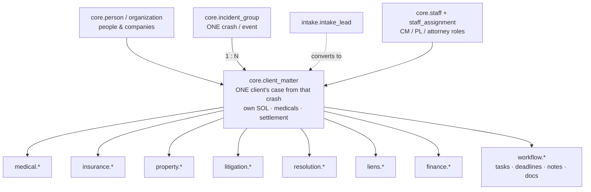
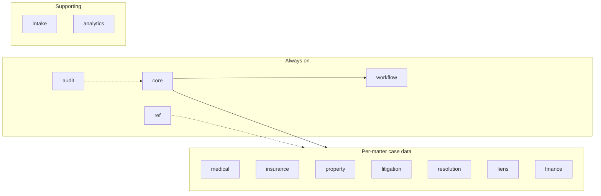
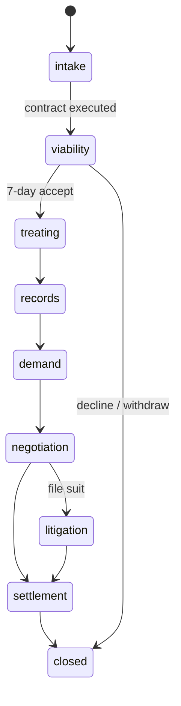
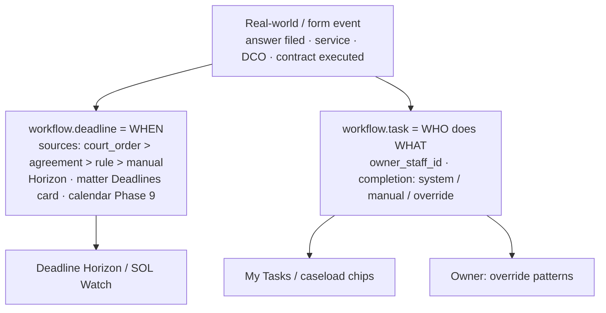
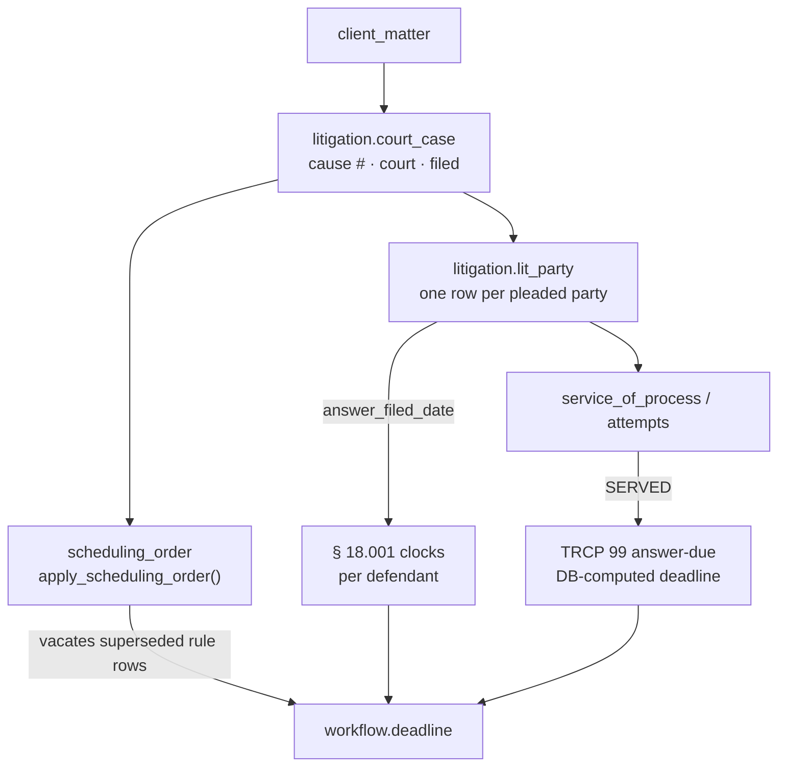
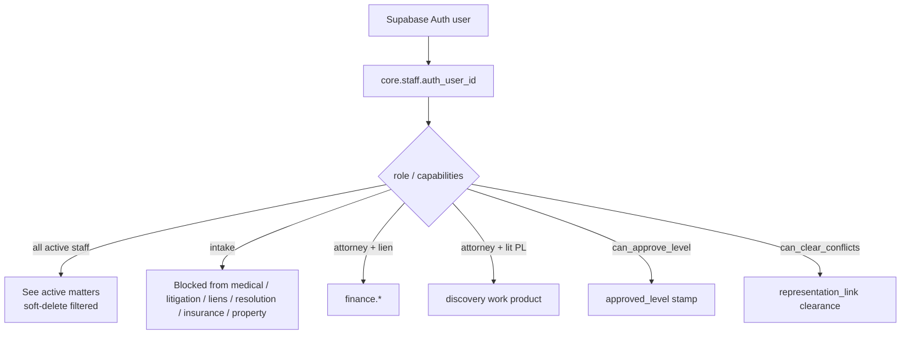
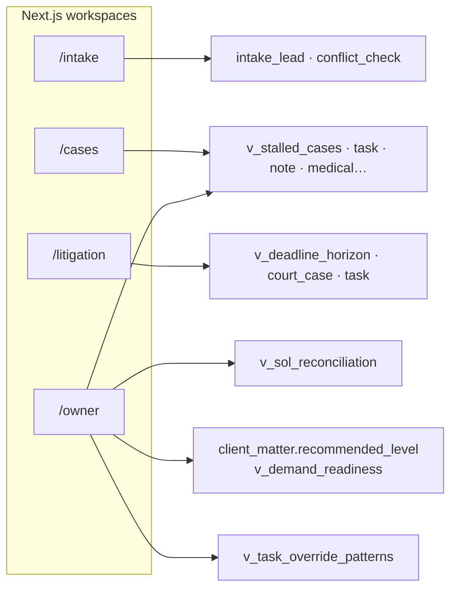

# Tuttle OS — Schema & Domain Flow

**Purpose:** Visual map of how data hangs together. The UI displays and captures state; **Postgres + RLS invent nothing.**  
**Detail:** `docs/schema-overview-for-designer.md` · **DDL:** `sql/01`→`05` · **v2.5 applied.**

---

## The spine (one crash → one or more matters)

**Companions:** multiple `client_matter` rows on the **same** `incident_group` = same crash, different clients. Cross-file copy requires `representation_link` conflict clearance.

---

## 12 schemas (domains)

| Schema | Holds |
|---|---|
| `core` | person, incident_group, client_matter, staff, SOL/limitations, conflicts |
| `intake` | leads before a matter exists |
| `medical` | treatment episodes, records, injuries, § 18.001 |
| `insurance` | claims, policies, adjusters |
| `property` | vehicles, PD claims |
| `litigation` | court_case, lit_party, service, DCO, discovery, mediation |
| `resolution` | demands, negotiation, settlement |
| `liens` | lien screen / holders |
| `finance` | fees, trust, disbursement (attorney + lien role) |
| `workflow` | **task** (WHO) + **deadline** (WHEN) + notes + documents |
| `ref` | dropdown codes (never hard-code in UI) |
| `audit` | immutable change_log |
| `analytics` | closed-case snapshots, velocity |

---

## Matter stage flow (lifecycle)

Owner watches **across** stages via stalled flags, Level approval, and SOL reconciliation — not a separate stage.

---

## The two engines (every workspace)

UI **never** invents authoritative legal dates — engines + `ref.deadline_rule` do; badge **ATTORNEY-VERIFY**.

---

## Litigation branch (per defendant)

---

## Security tiers (RLS — not UI)

Nav 🔒 is a hint; **API/RLS is the gate.**

---

## App → schema (what each workspace reads)

---

## Intentionally parked (not in live schema yet)

- **v2.2** Storage documents (`sql/optional/06`) — Phase 8  
- **v2.6** AI / OCR (`sql/optional/07`) — Phase 8 after BAAs  

---

## Related

| Doc | Use |
|---|---|
| `docs/schema-overview-for-designer.md` | Prose overview |
| `docs/PROJECT_PHASES.md` | Build order / phase status |
| `docs/DESIGN_NOTES.md` | Naming = API contract |
| `MASTER_PROMPT.md` §5–§6 | Engines + form→table map |
