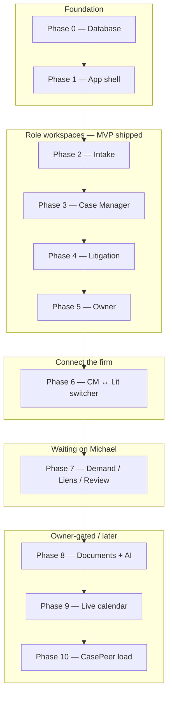
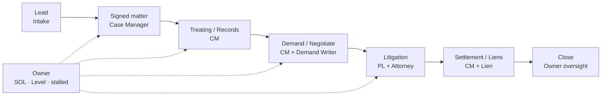
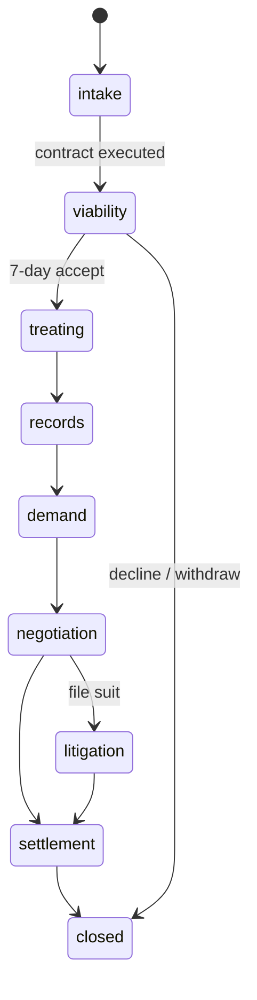
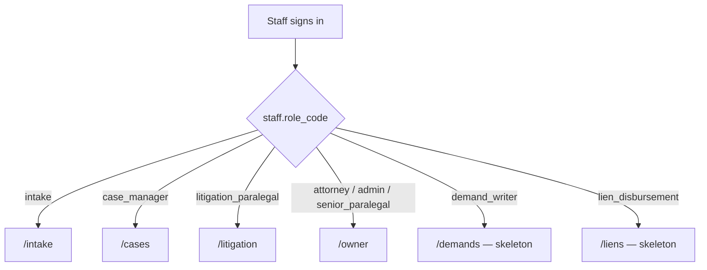
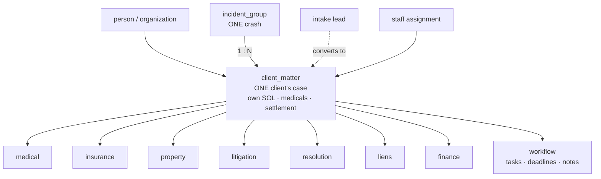
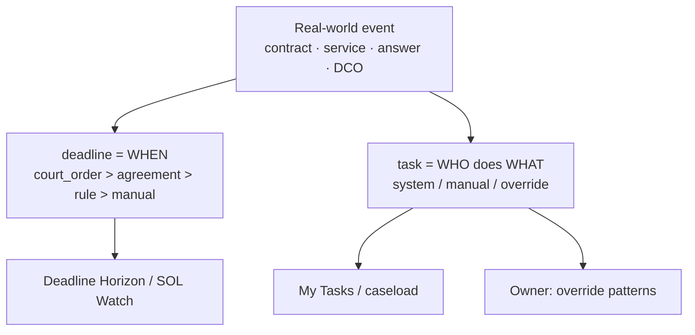
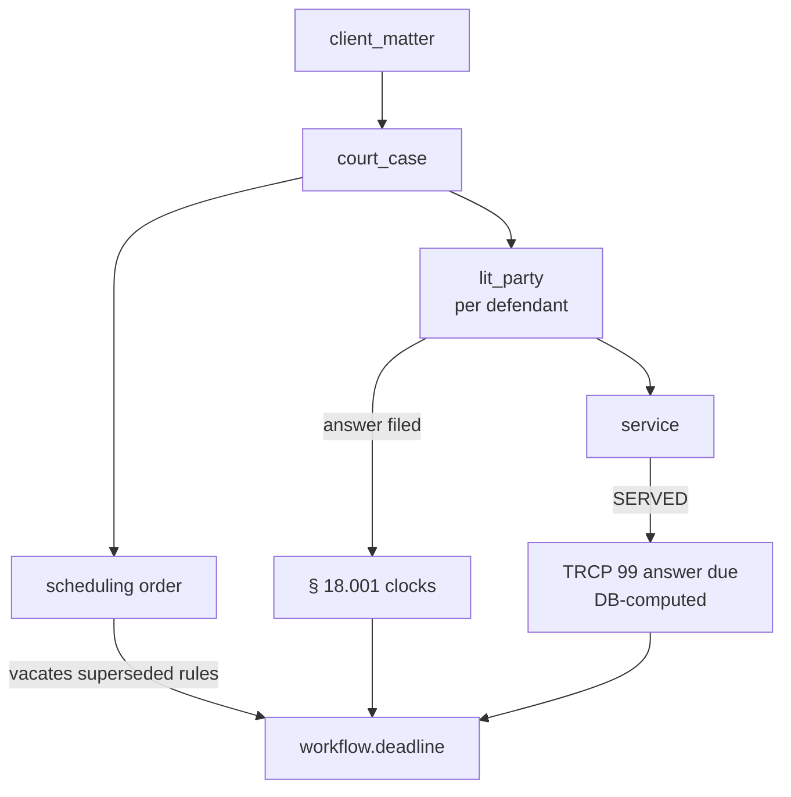
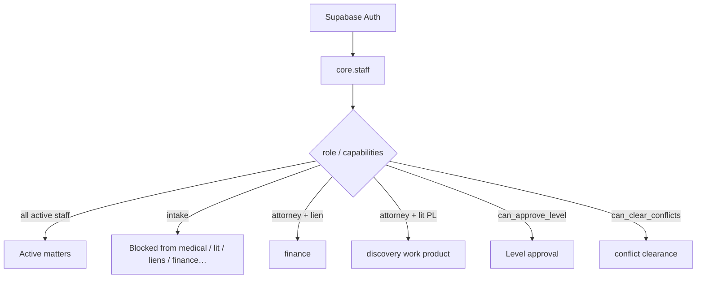
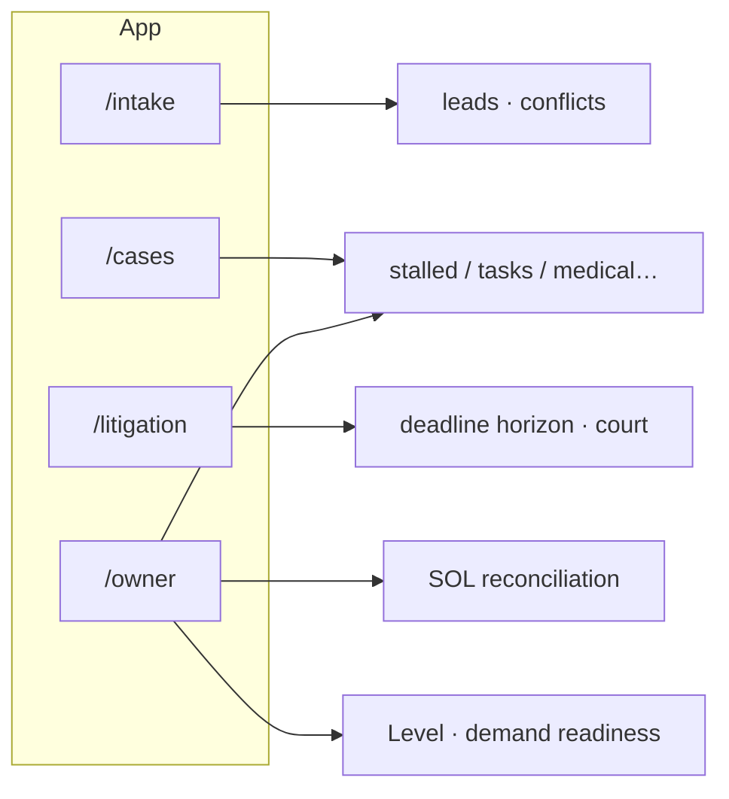
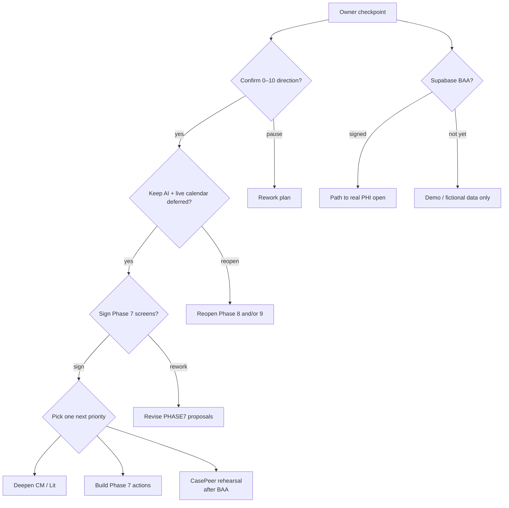

# Tuttle OS — Visual Workflows for Claude

**Use:** Paste this whole file into Claude, or copy one diagram at a time.  
**Ask Claude:** “Render these Mermaid diagrams and use them when presenting to Michael. Keep explanations short.”

Claude (and most Markdown viewers) render the ```mermaid blocks as flowcharts.

---

## 1. Build spine (phases 0–10)

**When to use:** “Where are we in the project?”



**Talking point:** Green path through Phase 6 exists. Pause at Phase 7 for Michael’s screen sign-off. 8–10 stay gated.

---

## 2. How a matter moves through the firm

**When to use:** “What does the product do day to day?”



**Talking point:** Owner watches across the firm; he is not a separate stage.

---

## 3. Matter stage lifecycle (database stages)

**When to use:** “What stages does a case go through?”



---

## 4. Who lands where after login

**When to use:** “Who sees what when they sign in?”



**Talking point:** Nav is a hint. RLS is the real gate.

---

## 5. Data spine (one crash → matters)

**When to use:** “How is the database structured?”



**Talking point:** Companions = multiple matters on the same crash.

---

## 6. The two engines (WHEN + WHO)

**When to use:** “Why don’t screens invent deadlines?”



**Talking point:** Rule-computed dates always show **ATTORNEY-VERIFY**.

---

## 7. Litigation branch (per defendant)

**When to use:** “How does filing / service / answer work?”



---

## 8. Security tiers (RLS)

**When to use:** “Is this HIPAA-ready / who can see medicals?”



---

## 9. App workspaces → data

**When to use:** “What does each screen actually read?”



---

## 10. Owner decision funnel (checkpoint)

**When to use:** End of the Michael briefing — “what do you need from me?”



---

## Suggested Claude prompt

```
You are briefing Michael Tuttle (attorney / owner of Crash Guy Injury Attorneys) on Tuttle OS.

Use docs/MICHAEL_OWNER_BRIEF.md for facts and the Mermaid diagrams in this file for visuals.

Rules:
- Plain language, short
- Database is the product
- Do not invent Phase 7/8/9 work
- End with the owner decision funnel and the sign-off questions
- Render each diagram when it helps; do not dump all ten at once unless asked
```

---

## Source files in the repo

| Diagram set | File |
|---|---|
| Phases + firm flow + login | `docs/PROJECT_PHASES.md` |
| Spine, engines, lit, RLS | `docs/SCHEMA_FLOW.md` |
| Owner narrative | `docs/MICHAEL_OWNER_BRIEF.md` |
| This pack | `docs/VISUAL_WORKFLOWS_FOR_CLAUDE.md` |
