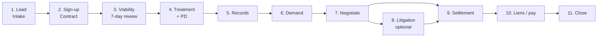
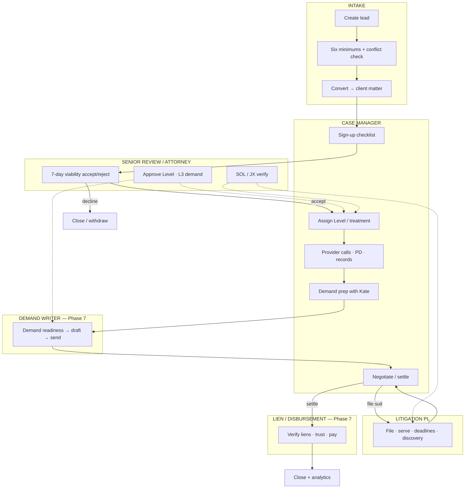
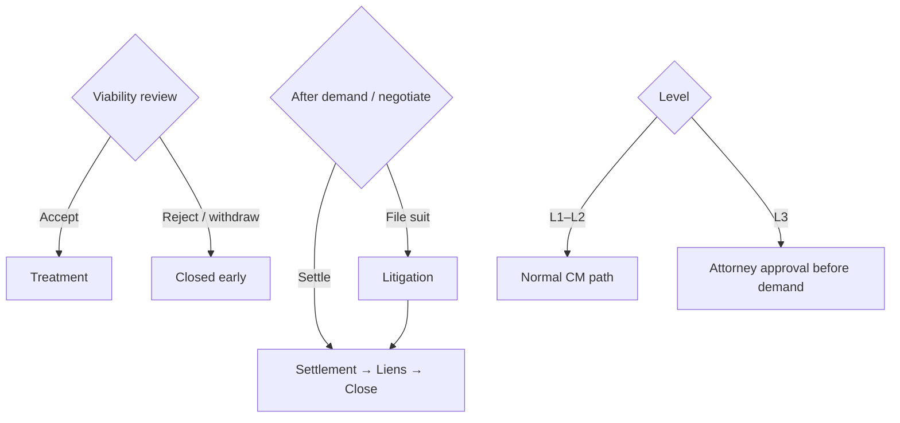

# Tuttle OS — Project Workflow: Lead → Case → Completion

**Use:** Paste into Claude for Michael.  
**Ask Claude:** “Walk Michael through this end-to-end. Use the diagrams. Note which steps are live MVP vs skeleton vs later.”

---

## Big picture (one page)



Owner watches the whole path (SOL, Level, stalled, approvals) — not a separate stage.

---

## Full swimlane (who owns each step)



---

## Step-by-step (staff playbook)

### 1. Create lead — Intake (`/intake` · `/intake/new`)
| | |
|---|---|
| **Who** | Intake staff |
| **Does** | New lead; capture six minimums; run conflict check |
| **Becomes** | `intake.intake_lead` |
| **Status** | **Live MVP** |

### 2. Convert to case — Intake → CM
| | |
|---|---|
| **Who** | Intake (with attorney/CM as needed) |
| **Does** | Convert lead → `core.client_matter` on an `incident_group` (one crash can have companion clients) |
| **Triggers** | Matter appears on Case Manager caseload |
| **Status** | **Live MVP** |

### 3. Sign-up / contract — Case Manager
| | |
|---|---|
| **Who** | CM |
| **Does** | Contract executed; complete system-generated **sign-up checklist** (LOR, coverage, etc.) |
| **Triggers** | DB creates checklist tasks; stage moves toward viability |
| **Status** | **Live MVP** (checklist/tasks) |

### 4. Viability (7-day review) — Senior review / Owner
| | |
|---|---|
| **Who** | Daniel (Senior PL) / Michael as needed |
| **Does** | Accept · conditions · more info · reject; Level recommendation |
| **Triggers** | Accept → treating; reject → closed/withdraw |
| **Status** | Review **queue skeleton** (`/review`); Owner sees overdue flags — **full actions await Phase 7 sign-off** |

### 5. Treatment + property damage — Case Manager
| | |
|---|---|
| **Who** | CM |
| **Does** | Providers, treatment status, provider-call cadence, PD status |
| **Owner watch** | Stalled flags (no contact, provider overdue, PD open, missing Level) |
| **Status** | **Live MVP** (core cards; not every mockup card) |

### 6. Records — Case Manager
| | |
|---|---|
| **Who** | CM |
| **Does** | Order / chase medical records until demand-ready |
| **Owner watch** | Records-aging flag |
| **Status** | **Live MVP** |

### 7. Demand — CM + Demand Writer (Kate)
| | |
|---|---|
| **Who** | CM prep · Kate draft/send · Attorney if **L3** |
| **Does** | Readiness (Level, treatment, records, PD, Kate reviewed) → draft → send → await response |
| **Owner** | Approves L3 demands; SOL Watch if filing clock matters |
| **Status** | CM demand surfaces **MVP**; Kate queue **skeleton** until Phase 7 signed |

### 8. Negotiation — Case Manager (+ attorney)
| | |
|---|---|
| **Who** | CM / Michael |
| **Does** | Offers, counters, policy limits pressure |
| **Fork** | Settle **or** file suit → litigation |
| **Status** | **Live MVP** (negotiation cards); deepen later |

### 9. Litigation (optional) — Lit PL + Attorney
| | |
|---|---|
| **Who** | Daniel (PL) · Michael |
| **Does** | File, serve defendants, answer clocks, scheduling order, discovery, mediation, trial prep |
| **Engines** | TRCP 99 answer-due · § 18.001 · court dates vacate statutory rows |
| **Status** | **Live MVP** caseload + Deadline Horizon + tasks; **later:** pizza tracker, full discovery pipeline |

### 10. Settlement — CM + Attorney
| | |
|---|---|
| **Who** | CM / Michael |
| **Does** | Settlement terms, release, closing checklist |
| **Status** | Schema-backed; UI deepens over time |

### 11. Liens & disbursement — Emily (+ attorney finance)
| | |
|---|---|
| **Who** | Emily · Michael on trust/finance |
| **Does** | Verify / negotiate liens → trust worksheet → client payout |
| **Status** | **Skeleton** (`/liens`) until Phase 7 signed |

### 12. Close — Owner oversight
| | |
|---|---|
| **Who** | CM completes · Owner may review |
| **Does** | Matter closed; analytics snapshot path |
| **Status** | Stage exists; closed-case analytics later polish |

---

## Decision forks (important)



---

## What “completion” means

A matter is **complete** when:

1. Representation ended (settled / judgment / withdraw / decline), **and**  
2. Liens / disbursement finished (if money moved), **and**  
3. Stage = **closed** (soft-deleted never used for “we’re done” — close is a stage, not a delete)

Owner still has SOL / audit history available after close for review.

---

## Live vs waiting (honesty for Michael)

| Path segment | Today |
|---|---|
| Lead → convert → CM caseload | **Live** |
| Sign-up checklist / treatment / PD / records / demand-negotiate cards | **Live MVP** |
| Owner firm attention / Approvals / SOL Watch | **Live MVP** |
| CM ↔ Lit switch on shared matters | **Live** |
| Viability / Demand / Lien **role actions** | **Waiting on Phase 7 sign-off** |
| Full lit pizza tracker + discovery machine | **Later** |
| AI on medicals · live calendar | **Deferred by you** |
| Real CasePeer clients | **After BAA + your migrate command** |

---

## Suggested Claude prompt

```
Present the Lead → Completion workflow to Michael Tuttle.
Use the diagrams in order: Big picture → Swimlane → Decision forks.
For each step, say who owns it and whether it is Live / Skeleton / Later.
End by asking which segment he wants deepened next (CM daily, Phase 7, or CasePeer).
```

---

## Related

| Doc | Use |
|---|---|
| `docs/MICHAEL_OWNER_BRIEF.md` | Owner status + sign-off |
| `docs/VISUAL_WORKFLOWS_FOR_CLAUDE.md` | Other diagrams (phases, RLS, engines) |
| `docs/PHASE7_SCREEN_PROPOSALS.md` | Kate / Emily / Daniel screens |
| `docs/SCHEMA_FLOW.md` | Database detail behind this path |
